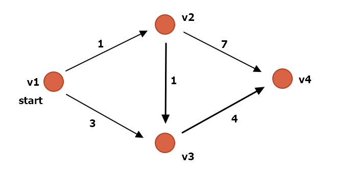

# Dijkstra's Shortest Path Algorithm

I started with the pseudocode for the Dijkstra's algorithm from [Algorithms Illuminated(Part2)](https://www.amazon.com/Algorithms-Illuminated-Part-Graph-Structures/dp/0999282921/ref=sr_1_2?crid=26G2NTPKV1D9D&keywords=algorithms+illuminated&qid=1560256915&s=gateway&sprefix=algorithms+%2Caps%2C172&sr=8-2)

Test Case is like below  
  

### Initialization
- Set all the Dijkstra score of all vertices to Infinity  
- Set the starting vertex(v1)'s Dijkstra score to 0  
- Add all vertices(v1, v2, v3, v4) into **Unexplored Set**, which implements **Heap data structure**
- since v1's Dijkstra score is the lowest, the first element of the **Unexplored Set** is v1 

**Dijkstra Score at a vetex Vn**
> The calculated distance from V1 to Vn-1 + the distance from Vn-1 to Vn

### Step 1  
- Add v1 to **Explored Set** by Heap.ExtractMin() method
- Set calculated distance to 0 (which is v1's score)
- From every edges where v1 is head, find its tail vertex and update its Dijkstra's score  
    1) v2: the score will be updated from Infinity to 1 ( 0 + 1 )
    2) v3: the score will be updated from Infinity to 3 ( 0 + 2 )
 
### Step 2  
- Add v2 to **Explored Set** by Heap.ExtractMin() method
- Set calculated distance to 1 (which is v2's score)
- From every edges where v2 is head, find its tail vertex and update its Dijkstra's score  
    1) v3: the score will be updated from Infinity to 2 ( 1 + 1 )
    2) v4: the score will be updated from Infinity to 8 ( 1 + 7 )

### Step 3  
- Add v3 to **Explored Set** by Heap.ExtractMin() method
- Set calculated distance to 2 (which is v3's score)
- From every edges where v3 is head, find its tail vertex and update its Dijkstra's score  
    1) v4: the score will be updated from 8 to 6 ( 2 + 4 )

## Done!  
- the Shortest Path is : v1 -> v2 -> v3 -> v4  
- Its length is 6